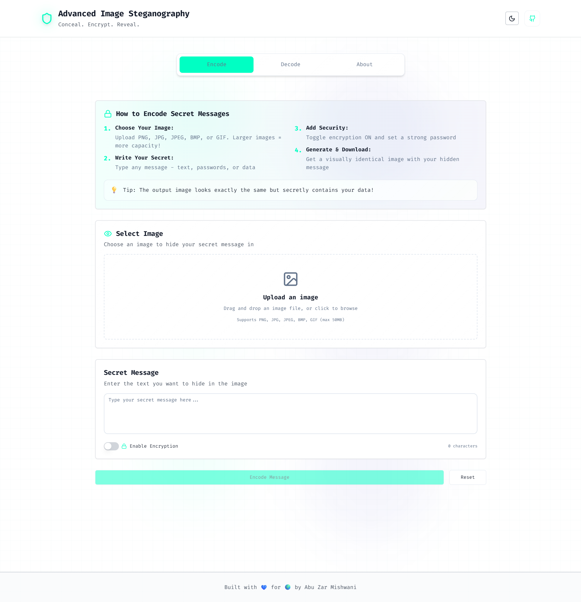
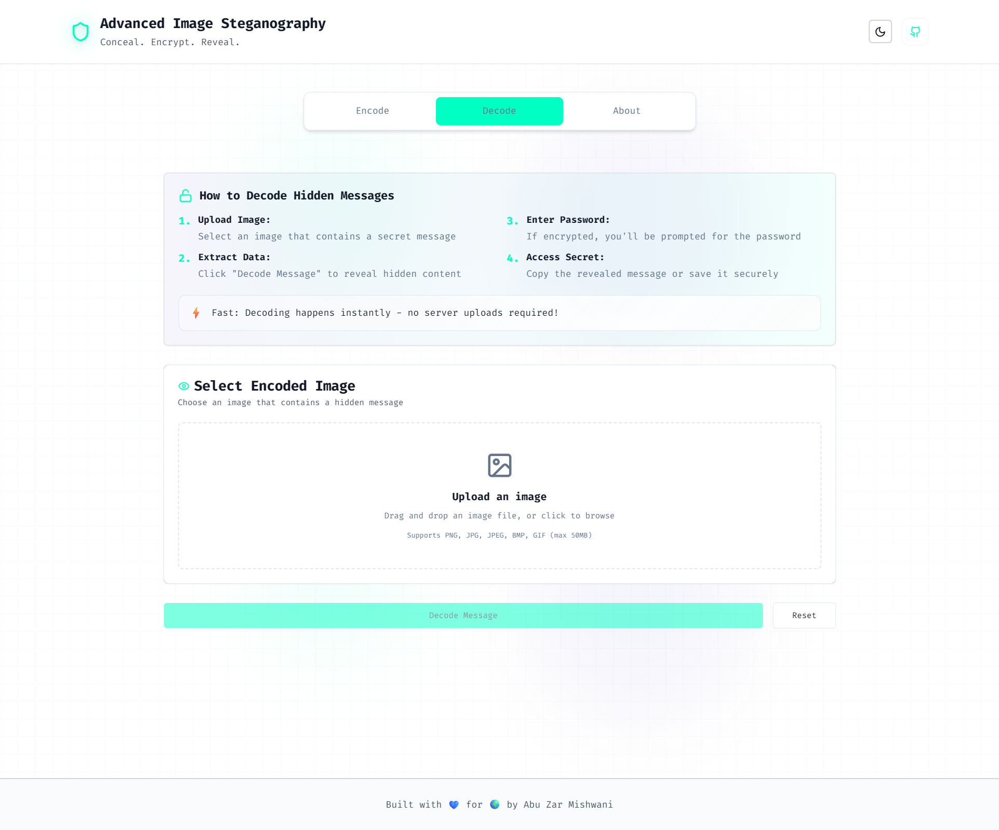
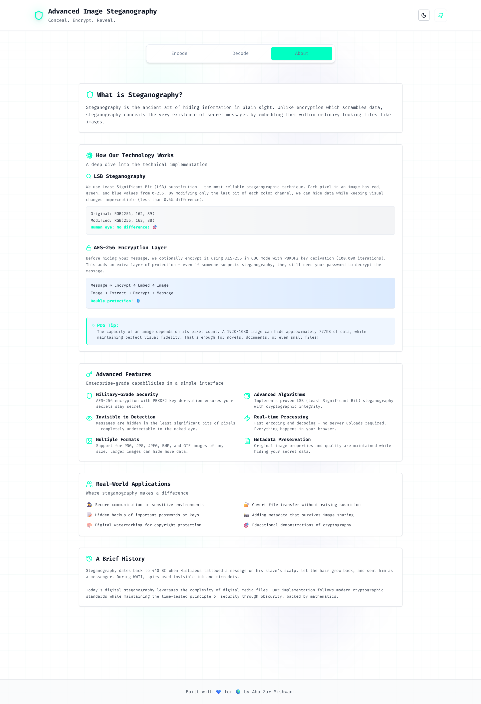

# 🔒 Advanced Image Steganography

A cutting-edge, professional web application for hiding and revealing secret messages in images using advanced steganography techniques with military-grade AES-256 encryption. Built with modern web technologies for a seamless, secure, and intuitive user experience.

## 🌐 Live Demo

**🚀 [Try it Live!](https://advanced-image-steganography-1xumv54ae.vercel.app)**

Experience the full application with all features - no installation required!

[](https://vercel.com/new/clone?repository-url=https%3A%2F%2Fgithub.com%2Fmishwani7%2FAdvanced-Image-Steganography)


## 📸 Screenshots

### Encode Tab - Hide Messages

*Hide secret messages in images with optional AES-256 encryption*

### Decode Tab - Reveal Messages  

*Extract and decrypt hidden messages from images*

### About Tab - Learn More

*Comprehensive information about steganography and security*

## ✨ Features Overview

### 🎯 Core Steganography Features

- **LSB (Least Significant Bit) Steganography**: Hide secret messages in image pixels with imperceptible visual changes
- **Multi-Format Support**: Works with PNG, JPG, JPEG, BMP, and GIF images
- **Real-time Image Preview**: See your encoded images before downloading
- **Lossless Hiding**: Messages are embedded without degrading image quality
- **Large Message Capacity**: Can hide substantial text based on image dimensions

### 🔐 Advanced Security Features

- **AES-256 Encryption**: Military-grade encryption with CBC mode
- **PBKDF2 Key Derivation**: 100,000 iterations for secure password-based encryption
- **Random Salt & IV Generation**: Unique 256-bit salt and 128-bit IV for each encryption
- **Client-Side Processing**: All encryption/decryption happens locally in your browser
- **Password Strength Validation**: Real-time feedback on password security
- **Secure Memory Handling**: Automatic cleanup of sensitive data

### 🎨 Modern User Experience

- **Intuitive Three-Tab Interface**: Encode, Decode, and About sections
- **Drag & Drop File Upload**: Modern file handling with visual feedback
- **Responsive Design**: Optimized for desktop, tablet, and mobile devices
- **Dark/Light Theme Toggle**: Sleek theme switching with persistent preferences
- **Futuristic Design**: Professional UI with smooth animations and glassmorphism effects
- **Accessibility First**: WCAG compliant with proper contrast ratios and keyboard navigation
- **Error Handling**: Comprehensive validation with clear, actionable error messages

### 🚀 Technical Excellence

- **Zero Dependencies on External Servers**: Complete client-side operation
- **Progressive Web App Ready**: Fast loading with optimized performance
- **Type-Safe Development**: Full TypeScript implementation
- **Memory Efficient**: Proper blob and URL management
- **Cross-Browser Compatible**: Works on all modern browsers

## 🛠️ Technology Stack

### Frontend Framework
- **React 18.3.1** - Modern React with concurrent features and hooks
- **Next.js 15.3.4** - Full-stack React framework with App Router
- **TypeScript 5** - Type-safe development with enhanced developer experience

### Styling & UI
- **Tailwind CSS 3.4.1** - Utility-first CSS framework with custom design system
- **Radix UI** - Accessible, unstyled component primitives
- **Framer Motion 12.23.0** - Smooth animations and page transitions
- **Lucide React** - Beautiful, consistent icon library
- **Custom Design System** - Futuristic cyber-themed components

### Steganography & Cryptography
- **HTML5 Canvas API** - Low-level pixel manipulation for steganography
- **CryptoJS 4.2.0** - Comprehensive cryptographic library for AES-256
- **Custom LSB Algorithm** - Optimized Least Significant Bit implementation
- **Secure Random Generation** - Cryptographically secure salt and IV generation

### File Handling & UX
- **React Dropzone 14.3.8** - Advanced drag & drop file upload
- **Blob API** - Efficient binary data handling
- **URL Object API** - Memory-safe file preview management

## 🚀 Quick Start

### Prerequisites
- **Node.js 18+** (Latest LTS recommended)
- **npm** or **yarn** package manager
- Modern web browser with ES2020+ support

### Installation

1. **Clone the Repository**
   ```bash
   git clone https://github.com/mishwani7/Advanced-Image-Steganography.git
   cd Advanced-Image-Steganography
   ```

2. **Install Dependencies**
   ```bash
   npm install
   # or
   yarn install
   ```

3. **Start Development Server**
   ```bash
   npm run dev
   # or
   yarn dev
   ```

4. **Open Application**
   Navigate to [http://localhost:3000](http://localhost:3000) in your browser

### Build for Production

```bash
# Build optimized production version
npm run build

# Start production server
npm start
```

## 📖 How It Works

### 🔍 Steganography Process

#### Encoding (Hiding Messages)
1. **Image Analysis**: Load and analyze the source image dimensions and color channels
2. **Message Preparation**: 
   - Optional AES-256 encryption with user-provided password
   - Metadata creation (encryption info, message length, format markers)
   - Binary conversion of the complete message payload
3. **LSB Embedding**: 
   - Modify the least significant bit of red channel pixels
   - Embed binary message data sequentially
   - Add end-of-message marker for reliable extraction
4. **Image Generation**: Create encoded PNG image visually identical to original
5. **Download**: Provide encoded image file for download

#### Decoding (Revealing Messages)
1. **Image Upload**: Accept and validate encoded image file
2. **LSB Extraction**: 
   - Read least significant bits from red channel pixels
   - Reconstruct binary message until end marker found
3. **Metadata Parsing**: Extract encryption status and parameters
4. **Decryption**: If encrypted, prompt for password and decrypt using stored parameters
5. **Message Display**: Show decoded message with copy functionality

### 🔒 Security Implementation

#### AES-256 Encryption Details
- **Algorithm**: AES-256 in CBC (Cipher Block Chaining) mode
- **Key Derivation**: PBKDF2 with 100,000 iterations (OWASP recommended)
- **Salt**: 256-bit cryptographically secure random salt
- **IV**: 128-bit random initialization vector
- **Padding**: PKCS#7 standard padding scheme
- **Security Level**: Equivalent to military-grade encryption standards

#### Privacy & Security Guarantees
- **No Server Communication**: All processing happens in your browser
- **No Data Storage**: Messages and passwords never leave your device
- **Memory Safety**: Automatic cleanup of sensitive data structures
- **Steganographic Security**: Hidden messages are undetectable without specialized analysis

## 📱 Usage Instructions

### 🔐 Encoding (Hiding) Messages

1. **Navigate to Encode Tab**
2. **Upload Source Image**: 
   - Drag & drop or click to select PNG, JPG, JPEG, BMP, or GIF
   - Maximum file size: 50MB
   - Larger images can hide longer messages
3. **Enter Your Secret Message**: 
   - Type or paste your message in the text area
   - No length limit (capacity depends on image size)
4. **Optional Encryption**:
   - Toggle encryption switch if desired
   - Enter a strong password (8+ characters recommended)
   - Use mix of letters, numbers, and symbols
5. **Process & Download**:
   - Click "Encode Message" button
   - Download the generated encoded image
   - Original image remains unchanged

### 🔓 Decoding (Revealing) Messages

1. **Navigate to Decode Tab**
2. **Upload Encoded Image**: 
   - Select the image containing hidden message
   - Must be an image previously processed by this tool
3. **Enter Password** (if encrypted):
   - Provide the password used during encoding
   - Leave blank for unencrypted messages
4. **Reveal Message**:
   - Click "Decode Message" button
   - Hidden message will be displayed
   - Use copy button to copy message to clipboard

### ℹ️ Learning About Steganography

1. **Navigate to About Tab**
2. **Explore Sections**:
   - What is Steganography?
   - Technical Implementation Details
   - LSB Algorithm Explanation
   - AES-256 Encryption Deep Dive
   - Security Features & Best Practices
   - Historical Context & Use Cases

## 🚀 Deployment

### Live Application

- **🌐 Production URL**: [https://advanced-image-steganography-1xumv54ae.vercel.app](https://advanced-image-steganography-1xumv54ae.vercel.app)
- **✅ Status**: Live and fully functional
- **⚡ Performance**: Global CDN with edge caching
- **🔒 Security**: HTTPS with automatic SSL certificates
- **📱 Responsive**: Optimized for all devices

## 📋 Recent Updates

### Latest Release (July 2025)
- ✅ **Fixed**: TypeScript build errors resolved
- 🚀 **Deployed**: Successfully deployed to Vercel production
- 🔧 **Improved**: Enhanced error handling and type safety
- 📱 **Optimized**: Better mobile responsiveness
- 🔒 **Security**: Strengthened encryption implementation

### Deploy Your Own Instance

#### Option 1: Deploy to Vercel (Recommended)

[](https://vercel.com/new/clone?repository-url=https%3A%2F%2Fgithub.com%2Fmishwani7%2FAdvanced-Image-Steganography)

1. Click the "Deploy with Vercel" button above
2. Sign in to Vercel with your GitHub account
3. Fork the repository to your account
4. Deploy automatically - no configuration needed!

#### Option 2: Manual Deployment to Vercel

```bash
# Install Vercel CLI
npm install -g vercel

# Login to Vercel
vercel login

# Deploy from project directory
vercel --prod
```

#### Option 3: Deploy to Other Platforms

- **Netlify**: Connect GitHub repository with Next.js build preset
- **Railway**: Connect GitHub repository with automatic deployment
- **Render**: Deploy from GitHub with Node.js environment
- **Cloudflare Pages**: Use Next.js build preset

## 🔒 Security Considerations

### Best Practices
- **Use Strong Passwords**: 12+ characters with mixed case, numbers, symbols
- **Verify Recipients**: Ensure secure delivery of encoded images
- **Original Image Security**: Keep source images private if needed
- **Password Management**: Use unique passwords for different messages
- **Device Security**: Ensure your device is secure and malware-free

### Limitations & Warnings
- **Steganography Detection**: Advanced analysis tools may detect hidden data
- **File Format Changes**: Converting encoded images may destroy hidden messages
- **Compression**: JPEG compression may corrupt hidden data
- **Social Media**: Platforms may recompress images, destroying hidden messages
- **Legal Compliance**: Ensure usage complies with local laws and regulations

## 🌐 Browser Compatibility

### Fully Supported
- **Chrome**: 88+ (recommended)
- **Firefox**: 85+
- **Safari**: 14+
- **Edge**: 88+

### Required Browser Features
- ES2020+ JavaScript support
- HTML5 Canvas API
- File API and Blob support
- CSS Grid and Flexbox
- WebCrypto API (for random generation)

## 🤝 Contributing

We welcome contributions! Please follow these steps:

### Development Setup
1. Fork the repository
2. Clone your fork: `git clone https://github.com/your-username/Advanced-Image-Steganography.git`
3. Install dependencies: `npm install`
4. Create feature branch: `git checkout -b feature/amazing-feature`
5. Make changes and test thoroughly
6. Commit changes: `git commit -m 'Add amazing feature'`
7. Push to branch: `git push origin feature/amazing-feature`
8. Open a Pull Request

### Contribution Guidelines
- Follow TypeScript and React best practices
- Maintain existing code style and formatting
- Add tests for new features
- Update documentation as needed
- Ensure accessibility compliance
- Test across multiple browsers and devices

## 📄 License

This project is licensed under the **MIT License** - see the [LICENSE](LICENSE) file for complete details.

### MIT License Summary
- ✅ Commercial use allowed
- ✅ Modification allowed
- ✅ Distribution allowed
- ✅ Private use allowed
- ❌ No liability or warranty provided

## 📞 Support & Contact

### Getting Help
- **Documentation**: Check this README and in-app About section
- **Issues**: Open GitHub issues for bugs and feature requests
- **Discussions**: Use GitHub Discussions for questions and ideas

### Contact Information
- **Developer**: Abu Zar Mishwani
- **GitHub**: [@mishwani7](https://github.com/mishwani7)
- **Project Repository**: [Advanced-Image-Steganography](https://github.com/mishwani7/Advanced-Image-Steganography)

---

<div align="center">
  <h3>🌟 Advanced Image Steganography 🌟</h3>
  <p><strong>Secure • Modern • Professional • Open Source</strong></p>
  <p>Built with 💙 for privacy enthusiasts and security professionals worldwide</p>
  <p>
    <a href="#-advanced-image-steganography">Back to Top</a> •
    <a href="https://github.com/mishwani7/Advanced-Image-Steganography">View on GitHub</a> •
    <a href="https://github.com/mishwani7/Advanced-Image-Steganography/issues">Report Issues</a>
  </p>
</div>
